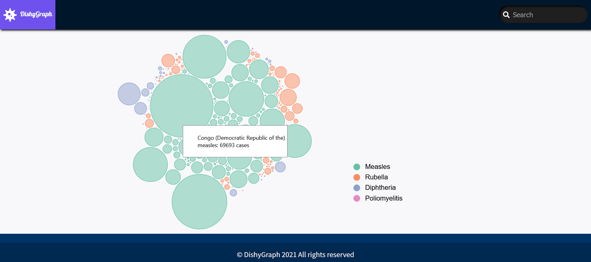

# DishyGraph
**DishyGraph is an Angular App, designed to help visualize WHO infectious diseases data.** 

On the home page each circle represents a country, you can hover it or click on it to have more information. Once you click on it you will be redirected to the country detail page on that one you can also click on a disease to see more information about it. 
 

 

## Getting started 
### Front end
1. Open the client folder and run in the terminal. \
    `npm i` 
2. Start the app by typing \
   `npm start`
### Back end
1. In the root folder run in the terminal. \
    `npm i` 
2. Start the server by running \
   `npm start`

## Tech stack
### Front end
- [Angular](https://angular.io/)
- [D3](https://d3js.org/)
### Back end
- [Express](https://expressjs.com/)
